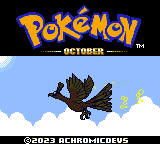
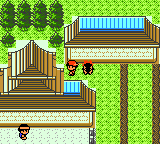
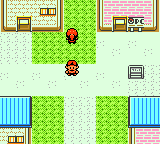
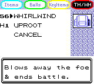
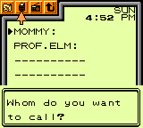
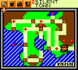
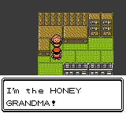
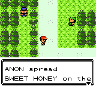
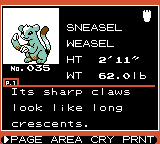
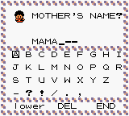

# Pokémon October

This is a Pokémon Crystal hack which uses [pokecrystal16](https://github.com/aaaaaa123456789/pokecrystal16) as a base. It uses a special variant of the MBC3 mapper (known as MBC30) only known to be used in Japanese Pokémon Crystal, which supports a maximum of up to 4MB ROM and 64KB SRAM. **Please see the [MBC30 compatibility table](https://gist.github.com/ZoomTen/1161fb269cd012a2b927560e3290a9f4) for emulator/system support.**

It uses (and derives from) [early Johto and Kanto maps](https://tcrf.net/Development:Pok%C3%A9mon_Gold_and_Silver/Unused_Maps/Towns_%26_Cities) from October and November 1998, mixed with select SW97 Pokémon, SW99 Pokémon, and other cut Pokémon. It is planned to have animations, an extended plot, the Orange Islands as an extra postgame area, and a fixed level curve balancing Kanto, Johto, and new mons. It'll also include many beta moves.

It is fully open-source, as long as credit is given to this hack. If credit is not found to be given, the hack's
author will be notified to do so. **[Additionally, Shockslayer, as well as anyone currently working on, moderating, or developing
the Crystal Clear project is NOT allowed to use any of the code contained within this repository, as long as they refuse to share their code for the wider ROM hacking community, *BESIDES* music ports.](https://youtu.be/_NzVmtbPOrM?t=58)**

## Screenshots

## Currently implemented features

* Everything that's in pokecrystal16
* Prerelease bag menu
* Prerelease Pokegear layout
* New story, new trainers, new Pokemon
* New items (e.g. beta Apricorn Balls)
* [Sweet Honey](https://protocrystal.neocities.org/honey) in its full glory!
* Type weakening hold items (Fire Mane, Mystic Petal, Ice Bikini)
* **(MBC30 only)** New animations
* **(MBC30 only)** Walking Pokémon, with actions for certain Pokémon
* And more&hellip;

## Build instructions

See [INSTALL.md](INSTALL.md).

## Credits

* Scarlax: animated sprites
* Pik, BloodlessNX, Kam, Poket, BimbelyGimbly: various sprites
* Darkshade: overworld Pokemon sprites
* Celadonk, Coraldev: custom music
* FroggestSpirit, Mmmmmmmmmmmmmmmmm: music ports
* AtmaBuster: walking/follower system base
* Shadow Ball, Traiyu, Quent: maps, story, dialog help
