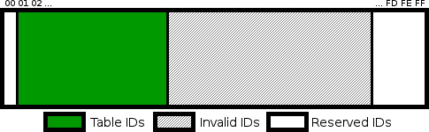

# 16-bit conversion table

At the core of the system lies the 16-bit conversion table. This is a data structure containing all of the information
that the system needs to allocate, manage and convert 8-bit IDs to and from 16-bit indexes. (Note: as mentioned in the
[Overview](Overview) page, the term "ID" will be used to refer to the 8-bit quantities, and the term "index" will
refer to the 16-bit values.)

* [Definition](#definition)
* [Declaration and layout](#declaration-and-layout)
* [Operation](#operation)

## Definition

For each subsystem whose indexes are to be converted to 16-bit, a conversion table must be created in some WRAM bank
(higher WRAM banks can be used for this purpose), aligned to a multiple of $100 bytes. (The code relies heavily on
this alignment, so it is very important to use an aligned base address.) The table itself will take up $100, $200 or
$300 bytes depending on how it is parameterized. This table must also be persisted across saves, so SRAM space for it
must be allocated as well, and care must be taken to copy the table to SRAM and back to WRAM when the game is saved
and/or loaded.

The contents of the table are defined by its parameters. In order to declare a data table, five constants must be
defined beforehand, named as follows (where `<TABLE>` represents a common prefix used to identify the table):

* `<TABLE>_ENTRIES`: defines the number of entries in the conversion table; must be between $20 and $FE. Each entry
  can be assigned to a 16-bit index or unassigned; 8-bit IDs will correspond to allocated entries, and will be
  numbered between 1 and this constant's value.
* `<TABLE>_LOCKED_ENTRIES`: defines the number of entries in the locked ID list. This is a small list that other parts
  of the code can use to mark certain IDs as "in use" and prevent their garbage collection. Unused entries in this
  list can be left as zero. If no locked IDs are wanted, this constant can be set to zero.
* `<TABLE>_CACHE_SIZE`: defines the number of entries in the ID cache; this must be either zero or a power of two. If
  there is a cache, whenever a 16-bit index is converted to an 8-bit ID, a hash of the index will be computed (with a
  bit width defined by the cache size), and the corresponding cache entry will be checked first; a cache hit will
  result in a much faster conversion, and a cache miss will result in the ID being recorded in the corresponding cache
  entry.
* `<TABLE>_SAVED_RECENT_INDEXES`: defines the size of the list of most recently allocated IDs; this list must be at
  least two entries long. Whenever a new 8-bit ID is allocated, it will be stored in this list, overwriting the oldest
  entry in it; the latest entry in the list will also be used as a starting point to search for free entries when
  attempting to allocate a new ID. The IDs in this circular buffer are protected from garbage collection; this allows
  code which allocates a small number of IDs for a short period of time to use them freely without having to peg them
  manually by storing them in the locked ID list.
* `<TABLE>_MINIMUM_RESERVED_INDEX`: determines the smallest ID that will be considered a negative reserved ID; this
  value must be larger than the number of entries in the table, but no larger than $FF. Reserved indexes are small
  non-positive values that are converted automatically and never stored in the conversion table; the corresponding IDs
  also convert back to the indexes automatically without any lookups. The index $0000 is always reserved, and so are
  indexes of the form $FFxx where the low byte is greater than or equal to this constant; all of these indexes map to
  their low byte when converted to IDs, and those IDs will map back to those indexes without using the table. (This
  means, for instance, that the index $FFFF will always map to the ID $FF, which allows existing code to continue
  using that value as a sentinel.)

In addition to the constraints mentioned above, the sum of the sizes of the locked ID list and the recent ID list must
not be greater than the number of entries, and the sum of these two plus the cache size must not be greater than $100.
These constraints ensure that the garbage collector will not lock up and that the code can take advantage of the $100
alignment.

## Declaration and layout

In order to declare a conversion table, the `wram_conversion_table` macro is supplied; this table takes two arguments
that will specify the name of the table: the first argument is a prefix that will be used for labels, and the second
one is the prefix used for the constants described in the previous section. (It is recommended that these two prefixes
correlate, as in the following example: `wram_conversion_table wFooTable, FOO_TABLE`.) This macro must be invoked in a
WRAM section and at an address aligned to a multiple of $100; the macro itself will always define a $100-aligned area,
so multiple invocations in a row are permitted. Since the macro takes care of all label definitions, it is not
necessary to prefix the macro invocation with a label.

The macro performs several size computations and constraint checks (in particular, it validates all the constraints
mentioned in the previous sections), and if all checks pass, it defines a conversion table with the correct layout.
The relevant portions of the macro (that is, the actual data declarations) are:

```
\1::
\1UsedSlots:: db
\1LastAllocatedIndex:: db
\1Entries:: ds 2 * \2_ENTRIES
\1EntriesEnd::
	ds ___padding
\1EntryCache:: ds \2_CACHE_SIZE
\1LockedEntries:: ds \2_LOCKED_ENTRIES
\1LastAllocated:: ds \2_SAVED_RECENT_INDEXES
\1End::
```

(Note: the actual macro contains several checks to avoid defining zero-length areas that are not reproduced here.
Comments and calculations are likewise removed; users are encouraged to check the source for the full version.)

This macro shows that the actual size of the table is given by the parameterization constants. (The padding will be
set to the minimum value that rounds up the size of the table to a multiple of $100; a careful choice of constants can
make this padding zero. The padding area is unused; user code is free to use it for any purpose.) It can also be seen
that the minimum reserved ID has no bearing on the table size; its value will be checked by the macro, but not used
for any additional purpose.

Most of the memory regions within the conversion table have been described alongside the constants that define their
sizes; only the two initial bytes remain unexplained. The used slots byte keeps a count of used slots in the table;
this count is used to determine whether the table is full and garbage collection is needed before allocating a new ID.
The last allocated index is an index into the last allocated ID list that points to the most recent one; this list is
a circular buffer, and so the last allocated index indicates where the head of the list is. (The tail of the list is
the entry one past the head.) The actual entries of the table will contain a 16-bit little-endian index when they are
occupied, or zero when they are free. ($0000 is a reserved index and thus never a valid value for an entry.)

## Operation

The constants above define three separate regions for 8-bit IDs, like so:



Zero and IDs greater than or equal to the minimum reserved ID will be considered reserved IDs; IDs between 1 and the
number of entries in the table will be considered table IDs. IDs that fall outside of these two regions will be
considered invalid; if the minimum reserved ID is exactly one greater than the number of table entries, no invalid IDs
will exist.

Conversion from an 8-bit ID to a 16-bit index depends on which of these three regions the ID falls into. Invalid IDs
are formally undefined; the current implementation will return an index of zero for all of them. Reserved IDs are
converted directly, without going through the table: the ID $00 converts to the index $0000, and other reserved IDs
(which lie at the top of the ID space) convert to the index $FFxx, where $xx is the ID in question.

Table IDs will be converted via a table lookup: the index in the corresponding table slot will be returned. This means
that, in order to use a table ID (which will invariably be the most common kind of ID), it must have been allocated
before; converting an unallocated table ID is formally undefined (although the current implementation will return zero
as with an invalid ID).

Allocation happens when the opposite conversion is attempted. Converting a 16-bit index to an 8-bit ID will allocate a
new ID if necessary. Converting a reserved index (that is, $0000 or an index of the form $FFxx where $xx is greater
than or equal to the minimum reserved ID) will return the corresponding reserved ID without any allocation or lookup.
In all other cases, the index will be searched in the table (using the cache if it is available, and sequentially if
a cache miss occurs or there is no cache); if there is already a table entry matching that index, that ID will be
returned. (This ensures that there are never two IDs pointing to the same index.)

If the 16-bit index is not found in the conversion table, a new ID is allocated for it and returned. If the table is
full, the garbage collector will run to free up some IDs and allocation will be reattempted. It is assumed that the
table is large enough to contain all IDs in use and a few extra, and thus the garbage collector is always assumed to
eventually succeed. (If the garbage collector fails, reattempting the allocation will trigger it again. Therefore, if
the garbage collector never succeeds, the game will enter an endless loop.)

The garbage collector uses a simple two-pass approach. First it marks IDs in use if they are found in various memory
locations that contain (or may contain) a valid ID; reserved, invalid and unallocated IDs are ignored by this process.
(The two lists of IDs in the table itself, namely the locked and recently allocated ID lists, are also checked by this
process.) After this is done, every table entry that hasn't been marked in use is freed up, and the free entries are
recounted to remove any potential damage caused by glitches. This is expected to release at least one ID, enough to
perform the new allocation.

It is also possible to run the garbage collector manually during known idle periods (such as when saving the game) in
order to make it run less often during active periods. While the garbage collector isn't particularly slow for its
defined purpose (it should run in less than a frame), running it in a loop must be avoided.
